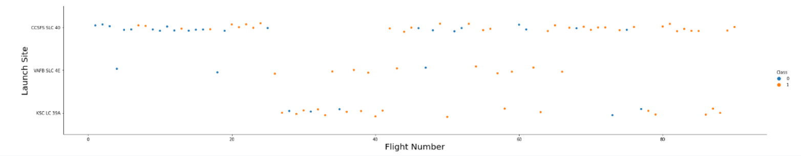
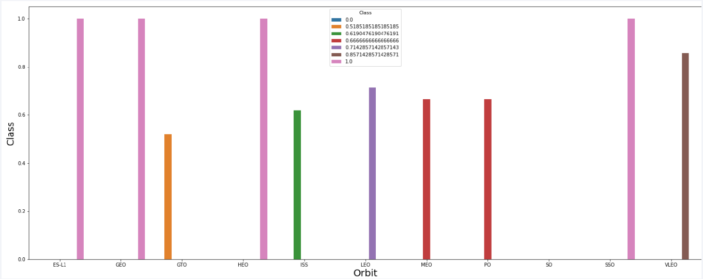
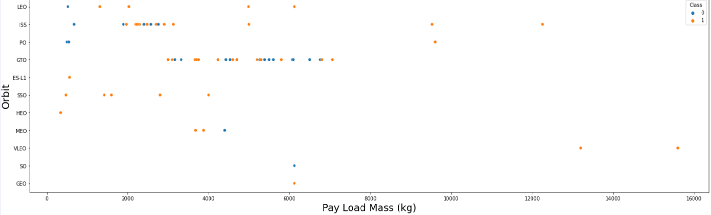
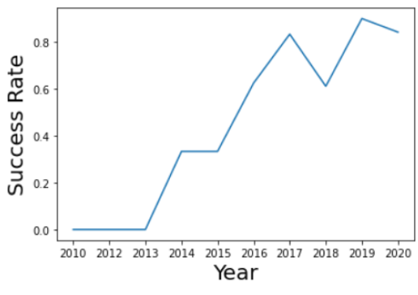
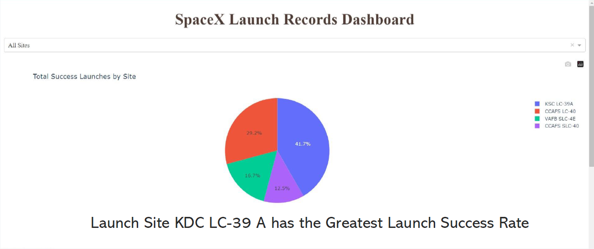
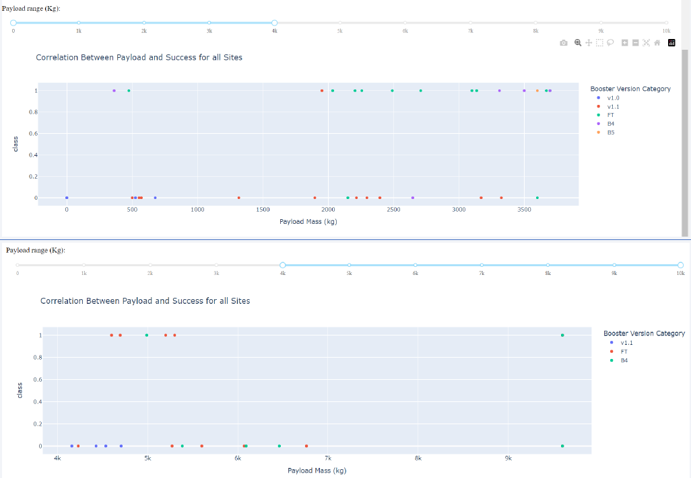
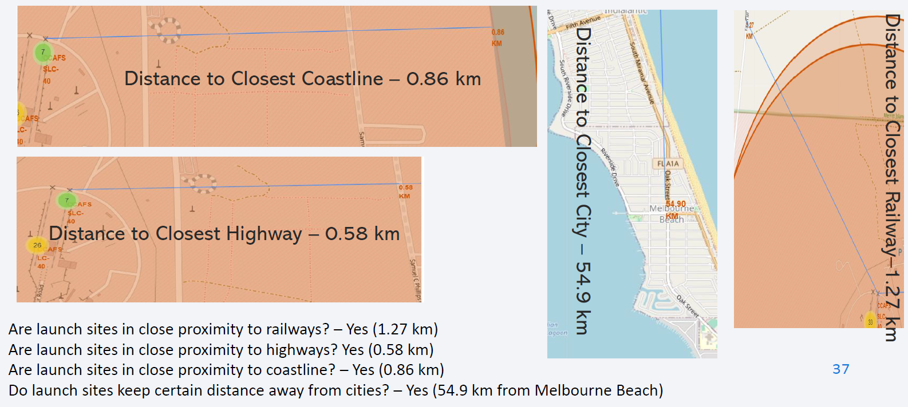
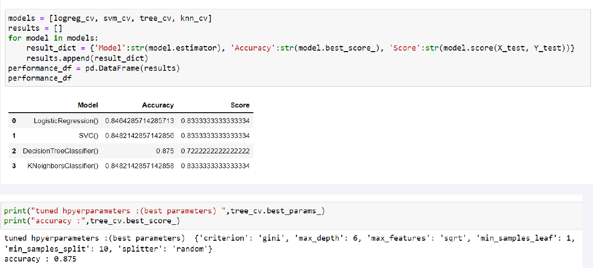
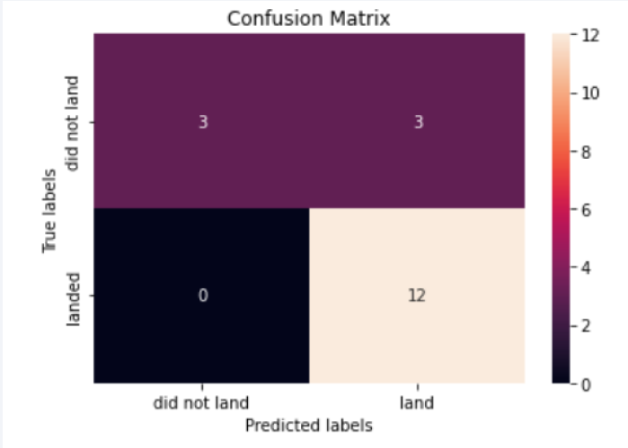

# Winning the Space Race with Data Science

## IBM Data Science Capstone Project

This project is the culmination of a six-month IBM Data Science Specialization. The goal was to develop a machine learning pipeline to predict the success of SpaceX Falcon 9 rocket’s first-stage landings. The project combines data collection, analysis, visualization, and machine learning to deliver actionable insights into the factors influencing landing outcomes.

---

## Table of Contents

1. [Project Overview](#project-overview)
2. [Getting Started](#getting-started)
3. [File Descriptions](#file-descriptions)
4. [Methodology](#methodology)
5. [Technologies Used](#technologies-used)
6. [Results](#results)
7. [Acknowledgments](#acknowledgments)
8. [Course Certificates](#course-certificates)

---

## Project Overview

SpaceX’s innovative reusable rocket technology significantly reduces launch costs, making it a leader in the aerospace industry. SpaceX advertises Falcon 9 rocket launches on its website with a cost of $62 million, whereas other providers charge upwards of $165 million per launch. Much of the savings come from SpaceX’s ability to reuse the first stage of the rocket. Therefore, determining if the first stage will successfully land is critical for assessing the cost and feasibility of a launch. This information is invaluable for alternate companies looking to compete with SpaceX in the rocket launch market.

### Objectives

- Identify key factors affecting landing success.
- Explore relationships among launch conditions, payloads, and outcomes.
- Develop interactive tools for analyzing launch data.
- Create a machine learning pipeline to predict the success of first-stage landings.

---

## File Descriptions

| File Name                                                      | Description                                                                            |
| -------------------------------------------------------------- | -------------------------------------------------------------------------------------- |
| `Dashboard.ipynb`                                              | Creates an interactive dashboard displaying launch success rates and payload outcomes. |
| `Data_Collection_API.ipynb`                                    | Collects data from SpaceX’s API.                                                       |
| `Data_Collection_Web_Scraping.ipynb`                           | Collects data via web scraping from Wikipedia.                                         |
| `Data_Wrangling.ipynb`                                         | Cleans and processes the collected data.                                               |
| `EDA_DataViz.ipynb`                                            | Performs exploratory data analysis (EDA) using visualization tools.                    |
| `EDA_SQL_SQLite.ipynb`                                         | Conducts EDA with SQL queries using SQLite and IBM Db2 on launch data.                 |
| `Launch_Sites_Locations_Analysis_Folium.ipynb`                 | Analyzes launch site locations using interactive maps with Folium.                     |
| `ML_Models.ipynb`                                              | Implements machine learning models to predict landing success.                         |
| `Project_Presentation_Data_Science_Capstone_Kunal_Sachdev.pdf` | Final project presentation summarizing findings and results.                           |

---

## Methodology

1. **Data Collection**

   - SpaceX API: Collected launch data using GET requests.
   - Web Scraping: Scraped historical Falcon 9 launch records from Wikipedia.

2. **Data Wrangling**

   - Cleaned and formatted data.
   - Created derived features for analysis.

3. **Exploratory Data Analysis (EDA)**

   - Conducted statistical and visual analysis to identify trends and insights.
   - Performed SQL-based EDA using IBM Db2 to query and analyze launch data effectively.
   - Used visualization tools like Matplotlib and Seaborn.

4. **Interactive Visualizations**

   - Built dashboards with Plotly Dash.
   - Created interactive maps with Folium to explore launch site success rates.

5. **Machine Learning Models**

   - Implemented Logistic Regression, KNN, SVM, and Decision Tree classifiers.
   - Tuned hyperparameters with GridSearchCV.
   - Achieved a classification accuracy of 87.5% using the Decision Tree classifier.

---

## Technologies Used

- **Data Collection**: `requests`, `BeautifulSoup`
- **Data Analysis**: `Pandas`, `NumPy`, `sqlite3`, `IBM Db2`
- **Visualization**: `Matplotlib`, `Seaborn`, `Plotly`
- **Interactive Tools**: `Dash`, `Folium`
- **Machine Learning**: `Scikit-learn`

---

## Results

- **Key Findings**:
  - The greater the number of flights at a launch site, the greater the success rate at the launch site.
    
    
    
  - ES-L1, GEO, HEO, and SSO orbits have the highest success rate.
    
    
    
  - For heavier payloads, success rate increases for LEO, ISS, and Polar orbits.
    
    
    
  - Launch success rate increased from 2013 to 2020 with minor fluctuations throughout the period.
    
    
    
  - Launch Site KDC LC-39 A has the greatest launch success rate.
    
    
    
  - Success Rate for Heavier Payload is lesser than that for Lighter Payload.
    
    
    
  - Launch Site Proximity to Coastline, Highways, Railways, and Cities.
    
    
    
  - The Decision Tree Classifier is the best machine learning algorithm to predict SpaceX Falcon 9 rocket’s first stage will land successfully.
    
    

- **Best Model**:
  - Decision Tree Classifier with an accuracy of 87.5%.
 
  - The confusion matrix for the Decision Tree Classifier reveals that while the model demonstrates strong overall performance in predicting successful landings, it produces a notable number of false positives. This indicates that the model occasionally predicts the rocket landed successfully when, in fact, it did not.
 
  - False positives are less critical than false negatives in this scenario, but they can lead to overestimating SpaceX's success rate, potentially resulting in misinformed decisions, such as overbidding or misallocating resources. On the other hand, false negatives - predicting a failure when the rocket actually lands - could discourage investment, reduce confidence in SpaceX’s capabilities, or lead to missed opportunities for competitors to challenge SpaceX effectively. While the model avoids false negatives, reducing false positives would still enhance its utility.
    
    

---

## Acknowledgments

This project was completed as part of the IBM Data Science Specialization. Special thanks to IBM and Coursera for providing the resources and guidance for this capstone project.

For further questions, feel free to reach out or explore the repository.

[Project Repository](https://github.com/KunalSachdev2005/IBM_DataScience_Capstone)

---

## Course Certificates

You can view the certificates for the IBM Data Science Specialization [here](https://github.com/KunalSachdev2005/IBM_DataScience_Capstone/blob/main/IBM_Data_Science_Professional_Course_Certificates.pdf).

